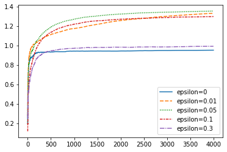
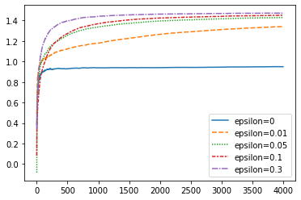

## Reinforcement Learning Notes

**[Resource1: Lectures, Books, Surveys and Thesis of Reinforcement Learning](https://github.com/aikorea/awesome-rl)**

**[Resource2: An Outsider’s Tour of Reinforcement Learning](http://www.argmin.net/2018/06/25/outsider-rl/)**

####  Basic Notations and Elements

- **Policy**: defines behavior of the learning agent at a given time
- **Reward Function**: defines the goal, or reward mapped to each perceived state
- **Value Function**: define the total reward in long run, our final goal to optimize

** the most important component in almost all RL problems is estimating *values***

Some RF methods don’t necessarily require to search for value functions, for example, the ***evalutionary methods***, including genetic algorithms, genetic programming, simulated annealing and so on.

- **Model**: to generate environment, or mimic the behavior of environments. For example, given a state and action, the model might predict the resultant next state and next reward

#### Evaluative Feedback

**N-armed Bandit Problem**

- **Denotions**
  - *value*: expected or mean reward given a selected action
  - *greedy action*: maintain estimates of each action values for each step, and there is always a greates action win over other actions
  - *Exploiting*: select the greedy action
  - *Exploring*: select the nongreedy action

**Exploitation is the right thing to do to maximize the expected reward on one play, but exploration may produce greater total reward in the long run**

**Action-Value Methods**

- **Denotions**

  - *a*: an action
  - $Q^{*}(a)$: true (actual) value of action *a*
  - $Q_{t}(a)$: estimated value of action *a*
  - *t*: rount of play
  - $k_{a}$: the times of action a has been chosen
  - $r_{k_{a}}$: the reward of action a after it has been chosen k times

  Then a simple way to estimate $Q_{t}(a)$ is:

  $Q_{t}(a)$ = $\frac{r_{1}+r{2}+…+r_{k_{a}}}{k_{a}}$

  If $k_{a}=0$, then default value is $Q_{t}(a)=0$;

  if $k_{a} \rightarrow \infty$, by the large number law, $Q_{t}(a) \rightarrow Q^{*}(a)$

- **$\epsilon$-greedy vs. greedy**

  design an experiment to asses the effectiveness of these two methods

  `Settings`:

  - 2000 n-armed bandit games, 1000 plays for each game
  - n=10, for each game
  - For each action, reward is randomly generated from $N~(Q^{*}(a),1)$ for 1000 round of plays
  - $Q^{*}(a)$ is randomly generated from $N(0,1)$ 2000 times for 2000 different games
  - record the performance after each 1000 plays
  - set $\epsilon$=0, 0.01, and 0.1

The code has been recaptured by myself. Here are the analytical results of $\epsilon$-greedy mrthods.

the above image depicts the total reward accumulated under different $\epsilon$ with 50 games, and 4000 rounds in each game.

This image depicts the optimal action’s accumulated reward. Other parameters setting is the same.

This image depicts the optimal action’s accumulated reward. Other parameters setting is the same.

**The advantage of this method depends on the task**

- If the variance is >1, it will take more exploration to find out the optimal action

- If variance=0, then the greedy method without $\epsilon$ will accumulate the optimal value

- **another complex situation is that the true value of each action changes overtime (nonstationary). And this is the commonly encountered situation in reinforcement learning.**

  

**Softmax Action Selection**

The probability of choosing each action now is given by a softmax method. The common method uses Gibbs or Boltzmann distribution.

It chooses action *a* on *t*th play with prob $\frac{e^{Q_{t}(a)/\tau}}{\sum_{b=1}^{n}e^{Q_{t}(b)/\tau}}$

Parameter $\tau$ is called **Tempreture**

- High temperature will cause actions to be all equiprobable. When $\tau \rightarrow \infty$, $prob \rightarrow \frac{1}{n}$. 
- Low temperature will cause actions to differ by their estimated values. When $\tau \rightarrow 0$, the method will become greedy.

Whether  epsilon-greedy or softmax is unclear. It depends on the task.

**Evaluations Versus Instructions**

- The reward received after each action gives some information about how good the action was, but it **says nothing at all about whether the action was correct or incorrect, that is, about whether or not it was best**
- RL sharply contrasts with supervised learning. **In supervised learning, there is no need to try various actions.** Feedback from the environment directly indicates what the action should have been. **Feedback is independently of actions taken.**

***Two examples to illustrat differnece in Evaluative and Instructive***

- Suppose there are 100 different actions. If you select action 32, evaluation will tell you the score you get from action 32. And you have to try various actions to find out the optimal strategy. Instruction would say what other action, say action number 67, would actually have been correct.

- Evaluative training and instructive training use different optimization algorithms.

  Instructive training use algo like Gradient Descent, to tell the algorithm where to go to search the parameter space.

  Evaluative training use other algos to explore around space for optimization. Typical examples are Robbins–Monro and the Kiefer–Wolfowitz stochastic approximation algorithms.

***Binary Bandit Problem***

…...

**Incremental Implementation**

The action-value methods mentioned above use sample average to estimate action values:

$Q_{t}(a)=\frac{r_{1_{a}}+r_{2_{a}}+…+r_{k_{a}}}{k_{a}}$

A problem with this straightforward method to estimate action values is that it increases the memory usage without bound when time t increases.

**Incremental Implementation** can solve this problem. This method can estimate action values without t appearing in the estimation.

**Denotions**:

- $Q_{k}$: average of first k rewards for some action.
- $Q_{k_{a}}$: the reward of action a at **kth** play. **Don’t mess up this with the above one.**

So the **incremental implementation** goes as follow:

$Q_{k+1} = \frac{1}{k+1}\sum_{i=1}^{k+1} r_{i}$

$= \frac{1}{k+1}(r_{k+1}+\sum_{i=1}^{k}r_{i})$

$=\frac{1}{k+1}(r_{k+1}+kQ_{k}+Q_{k}-Q_{k})$

$=\frac{1}{k+1}(r_{k+1}+(k+1)Q_{k}-Q_{k})$

$=Q_{k}+\frac{1}{k+1}(r_{k+1}-Q_{k})$

And the above method can be concluded as:

$NewEstimate \leftarrow OldEstimate+Stepsize(Target - OldEstimate)$

We denote the $Stepsize$ as $\alpha$.

When $\alpha=\frac{1}{k}$, then this is the sample average method.

**This is still the sample average method, but with a memory-saving method, which is incremental implementation**

**Tracking a Nonstationary Problem**

The above method is appropriate for stationary environment. For nonstationary environment, we can make $\alpha$ equal to a constant. **When $\alpha=constant$, the recent rewards will be given more weights than those past rewards.**

$Q_{k}=Q_{k-1}+\alpha(r_{k}-Q_{k-1})$

$Q_{k}=\alpha r_{k}+(1-\alpha)(Q_{k-1})$

$Q_{k}=\alpha r_{k}+(1-\alpha)(Q_{k-2}+\alpha(r_{k-1}-Q_{k-2}))$

$Q_{k}=\alpha r_{k}+\alpha(1-\alpha)r_{k-1}+(1-\alpha)^{2}Q_{k-2}$

…….

$Q_{k}=\alpha r_{k}+\alpha(1-\alpha)r_{k-1}+\alpha(1-\alpha)^{2}r_{k-2}+…+\alpha(1-\alpha)^{k-i}r_{i}+…+\alpha(1-\alpha)^{k-1}r_{1}+(1-\alpha)^{k}Q_{0}$

$Q_{k}=(1-\alpha)^{k}Q_{0}+\sum_{i=1}^{k}\alpha(1-\alpha)^{k-i}r_{i}$

