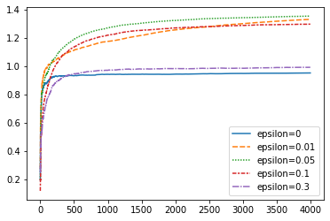
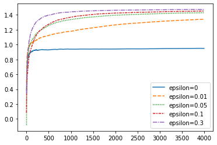

## Reinforcement Learning Notes

**[Resource1: Lectures, Books, Surveys and Thesis of Reinforcement Learning](https://github.com/aikorea/awesome-rl)**

**[Resource2: An Outsider’s Tour of Reinforcement Learning](http://www.argmin.net/2018/06/25/outsider-rl/)**

**[Resource3: Reinforcement Learning](https://github.com/RL-Research-Cohiba/Reinforcement_Learning)**

**[强化学习从入门到放弃](https://github.com/wwxFromTju/awesome-reinforcement-learning-zh)**

####  Basic Notations and Elements

- **Policy**: defines behavior of the learning agent at a given time
- **Reward Function**: defines the goal, or reward mapped to each perceived state
- **Value Function**: define the total reward in long run, our final goal to optimize

** the most important component in almost all RL problems is estimating *values***

Some RF methods don’t necessarily require to search for value functions, for example, the ***evalutionary methods***, including genetic algorithms, genetic programming, simulated annealing and so on.

- **Model**: to generate environment, or mimic the behavior of environments. For example, given a state and action, the model might predict the resultant next state and next reward

#### Chapter 2. Evaluative Feedback

**2.1 N-armed Bandit Problem**

- **Denotions**
  - *value*: expected or mean reward given a selected action
  - *greedy action*: maintain estimates of each action values for each step, and there is always a greates action win over other actions
  - *Exploiting*: select the greedy action
  - *Exploring*: select the nongreedy action

**Exploitation is the right thing to do to maximize the expected reward on one play, but exploration may produce greater total reward in the long run**

**2.2 Action-Value Methods**

- **Denotions**

  - *a*: an action
  - $Q^{*}(a)$: true (actual) value of action *a*
  - $Q_{t}(a)$: estimated value of action *a*
  - *t*: rount of play
  - $k_{a}$: the times of action a has been chosen
  - $r_{k_{a}}$: the reward of action a after it has been chosen k times

  Then a simple way to estimate $Q_{t}(a)$ is:

  $Q_{t}(a)$ = $\frac{r_{1}+r{2}+…+r_{k_{a}}}{k_{a}}$

  If $k_{a}=0$, then default value is $Q_{t}(a)=0$;

  if $k_{a} \rightarrow \infty$, by the large number law, $Q_{t}(a) \rightarrow Q^{*}(a)$

- **$\epsilon$-greedy vs. greedy**

  design an experiment to asses the effectiveness of these two methods

  `Settings`:

  - 2000 n-armed bandit games, 1000 plays for each game
  - n=10, for each game
  - For each action, reward is randomly generated from $N~(Q^{*}(a),1)$ for 1000 round of plays
  - $Q^{*}(a)$ is randomly generated from $N(0,1)$ 2000 times for 2000 different games
  - record the performance after each 1000 plays
  - set $\epsilon$=0, 0.01, and 0.1

The code has been recaptured by myself. Here are the analytical results of $\epsilon$-greedy mrthods.

the above image depicts the total reward accumulated under different $\epsilon$ with 50 games, and 4000 rounds in each game.

This image depicts the optimal action’s accumulated reward. Other parameters setting is the same.

**The advantage of this method depends on the task**

- If the variance is >1, it will take more exploration to find out the optimal action

- If variance=0, then the greedy method without $\epsilon$ will accumulate the optimal value

- **another complex situation is that the true value of each action changes overtime (nonstationary). And this is the commonly encountered situation in reinforcement learning.**

  

**2.3 Softmax Action Selection**

The probability of choosing each action now is given by a softmax method. The common method uses Gibbs or Boltzmann distribution.

It chooses action *a* on *t*th play with prob $\frac{e^{Q_{t}(a)/\tau}}{\sum_{b=1}^{n}e^{Q_{t}(b)/\tau}}$

Parameter $\tau$ is called **Tempreture**

- High temperature will cause actions to be all equiprobable. When $\tau \rightarrow \infty$, $prob \rightarrow \frac{1}{n}$. 
- Low temperature will cause actions to differ by their estimated values. When $\tau \rightarrow 0$, the method will become greedy.

Whether  epsilon-greedy or softmax is unclear. It depends on the task.

**2.3 Evaluations Versus Instructions**

- The reward received after each action gives some information about how good the action was, but it **says nothing at all about whether the action was correct or incorrect, that is, about whether or not it was best**
- RL sharply contrasts with supervised learning. **In supervised learning, there is no need to try various actions.** Feedback from the environment directly indicates what the action should have been. **Feedback is independently of actions taken.**

***Two examples to illustrat differnece in Evaluative and Instructive***

- Suppose there are 100 different actions. If you select action 32, evaluation will tell you the score you get from action 32. And you have to try various actions to find out the optimal strategy. Instruction would say what other action, say action number 67, would actually have been correct.

- Evaluative training and instructive training use different optimization algorithms.

  Instructive training use algo like Gradient Descent, to tell the algorithm where to go to search the parameter space.

  Evaluative training use other algos to explore around space for optimization. Typical examples are Robbins–Monro and the Kiefer–Wolfowitz stochastic approximation algorithms.

***Binary Bandit Problem***

…...

**2.4 Incremental Implementation**

The action-value methods mentioned above use sample average to estimate action values:

$Q_{t}(a)=\frac{r_{1_{a}}+r_{2_{a}}+…+r_{k_{a}}}{k_{a}}$

A problem with this straightforward method to estimate action values is that it increases the memory usage without bound when time t increases.

**Incremental Implementation** can solve this problem. This method can estimate action values without t appearing in the estimation.

**Denotions**:

- $Q_{k}$: average of first k rewards for some action.
- $Q_{k_{a}}$: the reward of action a at **kth** play. **Don’t mess up this with the above one.**

So the **incremental implementation** goes as follow:

$Q_{k+1} = \frac{1}{k+1}\sum_{i=1}^{k+1} r_{i}$

$= \frac{1}{k+1}(r_{k+1}+\sum_{i=1}^{k}r_{i})$

$=\frac{1}{k+1}(r_{k+1}+kQ_{k}+Q_{k}-Q_{k})$

$=\frac{1}{k+1}(r_{k+1}+(k+1)Q_{k}-Q_{k})$

$=Q_{k}+\frac{1}{k+1}(r_{k+1}-Q_{k})$

And the above method can be concluded as:

$NewEstimate \leftarrow OldEstimate+Stepsize(Target - OldEstimate)$

We denote the $Stepsize$ as $\alpha$.

When $\alpha=\frac{1}{k}$, then this is the sample average method.

**This is still the sample average method, but with a memory-saving method, which is incremental implementation**

**2.5 Tracking a Nonstationary Problem**

The above method is appropriate for stationary environment. For nonstationary environment, we can make $\alpha$ equal to a constant. **When $\alpha=constant$, the recent rewards will be given more weights than those past rewards.**

$Q_{k}=Q_{k-1}+\alpha(r_{k}-Q_{k-1})$

$Q_{k}=\alpha r_{k}+(1-\alpha)(Q_{k-1})$

$Q_{k}=\alpha r_{k}+(1-\alpha)(Q_{k-2}+\alpha(r_{k-1}-Q_{k-2}))$

$Q_{k}=\alpha r_{k}+\alpha(1-\alpha)r_{k-1}+(1-\alpha)^{2}Q_{k-2}$

…….

$Q_{k}=\alpha r_{k}+\alpha(1-\alpha)r_{k-1}+\alpha(1-\alpha)^{2}r_{k-2}+…+\alpha(1-\alpha)^{k-i}r_{i}+…+\alpha(1-\alpha)^{k-1}r_{1}+(1-\alpha)^{k}Q_{0}$

$Q_{k}=(1-\alpha)^{k}Q_{0}+\sum_{i=1}^{k}\alpha(1-\alpha)^{k-i}r_{i}$

We call this weighted average because $(1-\alpha)^{k}+\sum_{i=1}^{k}\alpha(1-\alpha)^{k-i}=1$

This is sometimes also called ***exponetial, recency-weighted average***

**Sometimes stepsize vary with timestep.   **$\alpha_{k}(a)$ **denotes the step-size parameter used to process the reward received after the kth selection of action a. **

However, when we choose various step-size, convergence is not guaranteed. Sample average ($\alpha=\frac{1}{k}$ gurantees convergence to true action value by LLN). 

**Two conditions required to guarantee convergence:**

- $\sum_{k=1}^{\infty}\alpha_{k}(a)=\infty$
- $\sum_{k=1}^{\infty}\alpha_{k}^{2}(a)<\infty$

Both conditions are met in sample average case ( $\alpha=\frac{1}{k}$ ), but the second condition is not met for constant step-size case ( $\alpha=const.$ ). And actually, this is desired in nonstationary case.

- The first condition is required to guarantee that the steps are large enough to eventually overcome any initial conditions or random fluctuations.
- The second condition guarantees that eventually the steps become small enough to assure convergence.

**2.6 Optimistic Initial Values**

All above methods have ignored the influence of initial action-value estimates $Q_{t=1}(a)$. In statistics, these methods are biased by their initial values.

***What are brought by this bias***

- Bias is permanent when $\alpha$ is constant but decrease over time.
- Bias disappears when $\alpha=\frac{1}{k}$ (sample average) after all actions have been selected as least once.
- **Upside**: provide a prior knowledge about what level of rewards can be expected
- **Downside**: initial estimates become another set of parameters need to be estimated
- When initial values are set far away from true value, this will encourage exploration, we call this strategy **optimistic initial values**. But this only works for ***stationary*** problem. 

**2.7 Upper-Confidence-Bound Action Selection**

When we do exploring, it would be better if we can consider actions’ uncertainties and potential for being optimal. One effective way of selecting action is by:

$A_{t}=argmax_{a}(Q_t(a)+c\sqrt{\frac{lnt}{N_{t}(a)}})$

- $A_t$ is the selection
- $lnt$ is the natural logarithm of time 
- $N_t(a)$ is the times of taking action a before time t, the same as $k_a$ we used before
- $c$ controls the degree of exploration

when $N_t(a)=0$, the corresponding action will be chosen, because an action never been explored has greatest potential.

**2.8 Gradient Bandits**

In above methods, we assign probabilities to each action during each play. **Now we consider a prefenrence $H_t(a)$ to decide the probability $\pi_t(a)$ of selecting action a at time t.**

$Pr(A_t=a)=\pi_t(a) = \frac{e^{H_t(a)}}{\sum_{b}^{n}e^{H_t(b)}}$

To learn these preferences, we can update preferences after each step by:

- $H_{t+1}(a) = H_{t}(a)+\alpha(R_t-\bar{R_{t}})(1-\pi_{t}(A_t))$  for $a = A_{t}$  (2.10)
- $H_{t+1}(a) = H_{t}(a)-\alpha(R_t-\bar{R_{t}})\pi_{t}(A_t)$   $\forall a \ne A_{t}$    (2.10)

where $\alpha$ is the step-size (depends on stationary or nonstationary problem), $\bar{R}$ is the average of all rewards up to time t.

** Based on the preference-updating function, we can tell that, once the selected action increases current reward, then the preference of selecting this action will increase also. Vice versa.**

***One can gain a deeper insight into above algorithm by understanding stochastic approximation of gradient ascent. In the perspective of SGA, the algorithm goes like:***

- $H_{t+1}(a) = H_{t}(a)+\alpha\frac{\partial\mathbb{E}[R_t]}{H_{t}(a)}$  (2.11)

- where   $\mathbb{E}[R_t]=\sum_{b}^{n}q(b)\pi(b)$

 $q(b)$ is the true reward get from action b. However, we don’t know $q(b)$. Fortunately, **the updates in algorithm 2.10 equals to algorithm 2.11 in expected values.**

***Mathematical Proof***

$H_{t+1}(a) = H_{t}(a)+\alpha\frac{\partial\mathbb{E}[R_t]}{\partial H_{t}(a)}$

Focus on $\frac{\partial\mathbb{E}[R_t]}{H_{t}(a)}$

$\frac{\partial\mathbb{E}[R_t]}{H_{t}(a)} = \frac{\partial\sum_{b}^{n}q(b)\pi(b)}{\partial H_{t}(a)}$ 

=$\sum_{b}^{n}q(b) \frac{\partial \pi(b)}{\partial H_t(a)}$     $q(b)$ can be extracted before because true reward is fixed. $\pi(b)$ is a function of $H_t(b)$

=$\sum_{b}^{n}(q(b)-X_t) \frac{\partial \pi(b)}{\partial H_t(a)}$    

…...

**2.9 Associative Search**

…...

#### Chapter 3. Finite Markov Decision Process

**3.1 The Agent-Environment Interface**

- The learner and decision-maker is called *agent*
- The thing *agent* interacts with, comprising everything outside the agent, is called *environment*
- A complete specification of an environment defines a *task*, one instance of reinforcement learning problem

The interaction happens continually at each of a time sequence $t=0,1,2,3……$

At each $t$, agent receives a state $S_t$, on that basis select an action $A_t \in \mathbb{A}(S_t)$, one time step later, agent receives reward $R_{t+1}$, and the environment goes into $S_{t+1}$. Before loop goes recurrently.

**The agent implements a mapping from states to probabilities of selecting the each possible action.**

- For example, $\pi_{t}(a|S)$ represents the prob. of choosing action a when in state S of time-step t.

**Sometimes the boundary between agent and environment can be confusing.**

- General rule we follow is that anything cannot be changed arbitrarily by the agent is considered to be outside of it and thus part of the environment.

**Any problem of learning goal-directed behavior
can be reduced to three signals passing back and forth between an agent and
its environment**

- **Signal1**: represent the choices made by the agent. (actions)
- **Signal2**: represent the basis where choices are made. (states)
- **Signal3**: define the agent’s goal. (rewards)

This frame is not sufficient to represent all, but widely useful.

**3.2 Goals and Rewards**

- The rewards are computed in th environment rather than in the agent.
- The reason we do this is the ultimate goal of agent should be something over which it has imperfect controls.

**3.3 Returns**

Denote the sequence of rewards after time $t$ to be $R_{t+1}, R_{t+2}…$, in general, we seek to maximize the expected return. A straightforward way to express is:

$G_{t} = R_{t+1}+R_{t+2}+R_{t+3}+…+R_T$

**Use above denotion to introduce 2 reinforcement learning tasks:**

- **Episodic**: such as plays of a game, trips through a maze, or any repeated interactions. Each episode ends in a special state called **Terminal State ($S_T$)**.

- **Continuing**: in many cases, agent-environment interactions cannot be break into episodes, but goes continually without limit. $T=\infty$.

- **Discounting**: this is an additional concept other than **Episodic** and **Continuing**. Sometimes future rewards need to be discounted when setting up our current goal.

  $G_{t} = R_{t+1}+\gamma R_{t+1}+\gamma^{2}R_{t+2}+\gamma^{3}R_{t+3}+…=\sum_{k=0}^{\infty}(\gamma^{k}R_{t+k+1})$, where $\gamma$ is called discount rate and $0\le\gamma\le1$

**3.4 Unified Notations for Episodic and Continuing Tasks**

We use $S_{t,i},A_{t,i},R_{t,i},\pi_{t,i},T_{i}$, to represent state at time $t$ of episode $i$.

Another notation is for covering both episodic and continuing tasks.

The solid-squared state is called ***absorbing state*** for episodic task. This is corresponding to the end of the episode. Rewards of ***absorbing state*** are always 0.

By applying ***absorbing state***, we can unified write the current return of both episodic and continuing tasks in  the way of:

$G_{t}=\sum_{k=0}^{T-t-1}\gamma^{k}R_{t+k+1}$

**3.5 The Markov Property**

- ***State Signal***:
  1. The state signal should include immediate sensations such as sensory measurement. But of course, sometimes more than that
  2. The state signal should not inform the agent of everything about the environment, or even everything that would be useful for making decisions
  3. What we would expect, is a state signal that summarizes past sensations compactly, yet in such a way that all relevant information is retained. A state signal that succeeds in retaining all relevant information is said to be ***Markov***, or to have the ***Markov property***

**Consider how a general environment respond at time *t+1* given the action at time *t*.**

$PR\{R_{t+1}=r, S_{t+1}=s’|S_0,A_0,R_1…S_{t-1},A_{t-1},R_{t},S_t,A_t\}$

**If the state signal has Markov Property, then the environment's response at t+1 depends only on the state and action representations at t**

$p(s’,r|s,a)=PR\{R_{t+1}=r, S_{t+1}=s’|S_t,A_t\}$   (3.5)

***If an state has Markov property, then its one-step dynamics (3.5) enable us to predict the next state and expected next reward given the current state and action***

***By iterating this equation (3.5), one can also predict all future states and expected reward***

**For all of these reasons, it is useful to think of the state at each time step as an approximation to a Markov state, although one should remember that it may not fully satisfy the Markov property.**

**3.6 Markov Decision Process**

A reinforcement learning task that satises the Markov property is called a ***Markov decision process, or MDP.***

- if the state and action space is finite, we call this Finite ***Markov Decision Process, or Finite MDP***
- 90% reinforcement learning problems can be covered by Finite MDP.

**A particular finite MDP is dened by its state and action sets and by the one-step dynamics of the environment. Given any state s and action a, the probability of each possible pair of next state and reward, s' r is denoted**

$p(s’,r|s,a) = Pr\{S_{t+1}=s’,R_{t+1}=r|S_{t}=s,A_{t}=a\}$   (3.6)

Given the dynamic state specified by (3.6), one can compute any anything else of the environment, such as the 

- **expected rewards of state-action pairs.**

  $r(s,a)=\mathbb{E}[R_{t+1}|S_t=s,A_t=a]=\sum_{r\in \mathcal{R}}rp(s,a)=\sum_{r\in \mathcal{R}}r\sum_{s'\in \mathcal{S}}p(s',r|s,a)$, where $\mathcal{R}$ and $\mathcal{S}$ are reward and state spaces.

- **State-Transition Probabilities**

  $p(s’|s,a)=Pr\{S_{t+1}=s’|S_t=s,A_t=a\}=\sum_{r\in R}p(s’,r|s,a)$

- **Expected Rewards for state-action-next-state triples**

  $r(s’,a,s)=\mathbb{E}[R_{t+1}|S_{t+1}=s’,S_t=s,A_t=a]= \sum_{r\in \mathcal{R}}rp(r|s’,a,s) =\frac{\sum_{r\in R} p(s’,r|s,a)}{p(s’|s,a)}$

  

**3.7 Value Functions**

Recall that a policy $\pi$, is a mapping from each state $s\in \mathcal{S}$, and each action $a \in \mathcal{A}(s)$, to the probability $\pi(a|s)$ of taking action a in state s.

- ***<u>Informally, the value of a state $s$ under a policy $\pi$, denoted $v_{\pi}(s)$, is the expected return when starting in $s$ and following $\pi$ thereafter.</u>***

  For MDPs, we can define $v_{\pi}(s)$ formally as:

  $v_{\pi}(s)=\mathbb{E}_{\pi}[G_t|S_t=s]=\mathbb{E}_{\pi}[\sum_{k=0}^{\infty}\gamma^{k}R_{t+k+1}|S_t=s]$

  where $\mathbb{E}[.]$ denotes the expected value of a random variable given that agent always follow policy $\pi$.

  *** We call function*** $v_{\pi}$ ***the state-value function for policy*** $\pi$.

- <u>***Similarly, we define the value of taking action $a$ in state $s$ under a policy $\pi$, denoted $q_{\pi}(s,a)$, as the expected return starting from $s$, taking the action a, and thereafter following policy $\pi$.***</u>

  $q_{\pi}(s,a) = \mathbb{E}_{\pi}[G_t|S_t=s,A_t=a]=\mathbb{E}_{\pi}[\sum_{k=0}^{\infty}\gamma^{k}R_{t+k+1}|S_t=s,A_t=a]$

  *** We call function*** $q_{\pi}$ ***the action-value function for policy*** $\pi$.

- Value functions $v_{\pi}$ and $q_{\pi}$ can be estimated by experience:

  - if an agent follows policy $\pi$ in each state $s$ encountered, and maintain the average of the reward followed in that state, then it will finanlly converge to $v_{\pi}$ as approach to infinity:

    $lim_{N\rightarrow\infty}\{\frac{1}{N}\sum_{t=0}^{N}r_{t}(s,\pi(s))\}\rightarrow v_{\pi}(s)$

  - if seperate average are recorded for each action taken (mapped by the policy), then the average will finally converge to $q_{\pi}$

    $lim_{m_{1}\rightarrow\infty}\{\frac{1}{m_{1}}\sum^{m_{1}}r(s,a_{1}=\pi(s))\}\rightarrow q_{\pi}(s,a_{1})$

    $lim_{m_{2}\rightarrow\infty}\{\frac{1}{m_{2}}\sum^{m_{2}}r(s,a_{2}=\pi(s))\}\rightarrow q_{\pi}(s,a_{2})$

    ...

    $lim_{m_{n}\rightarrow\infty}\{\frac{1}{m_{n}}\sum^{m_{n}}r(s,a_{n}=\pi(s))\}\rightarrow q_{\pi}(s,a_{n})$

    where $\mathcal{A}(s)=\{a_{1},a_{2},…,a_{n}\}$ and $\sum_{i=0}m_{i}=N$

  - The estimation method **Monte Carlo Simulation** will be introduced later.

- A fundamental property of value functions used throughout reinforcement learning and dynamic programming is that **<u>they satisfy particular recursive relationships.</u>** For any policy $\pi$ and any states $s$, the following consistency condition holds between the value of $s$ and the value of its possible successor states:

  $v_{\pi}(s)=\mathbb{E}[G_t|S_t=s]$

  $=\mathbb{E}_{\pi}[\sum_{k=0}^{\infty}\gamma^{k}R_{t+k+1}|S_t=s]$

  $=\mathbb{E}_{\pi}[R_{t+1}+\sum_{k=1}^{\infty}\gamma^{k}R_{t+k+1}|S_t=s]$

  $=\mathbb{E}_{\pi}[R_{t+1}|S_t=s]+\mathbb{E}_{\pi}[\gamma\sum_{k=0}^{\infty}\gamma^{k}R_{t+k+2}|S_t=s]$

  $=\sum_{r\in R}r*p(r|s)+\mathbb{E}_{\pi}[\gamma\sum_{k=0}^{\infty}\gamma^{k}R_{t+k+2}|S_t=s]$

  $=\sum_{r\in R}r*\sum_{a \in \mathcal{A}(s)}\pi(a|s)p(r|s,a)+\gamma\mathbb{E}_{\pi}[\sum_{k=0}^{\infty}\gamma^{k}R_{t+k+2}|S_t=s]$

  $=\sum_{r\in R}r*\sum_{a \in \mathcal{A}(s)}\pi(a|s)\sum_{s'\in \mathcal{S}}p(s’,r|s,a)+\gamma\mathbb{E}_{\pi}[\sum_{k=0}^{\infty}\gamma^{k}R_{t+k+2}|S_t=s]$

  $=\sum_{a \in \mathcal{A}(s)}\pi(a|s)\sum_{s'\in \mathcal{S},r\in \mathcal{R}}p(s’,r|s,a)(r+\gamma\mathbb{E}_{\pi}[\sum_{k=0}^{\infty}\gamma^{k}R_{t+k+2}|S_{t+1}=s'])$

  $=\sum_{a}\pi(a|s)\sum_{s’,r}p(s’,r|s,a)(r+\gamma v_{\pi}(s'))$      （3.12）

  This equation is called ***Bellman Equation*** for $v_{\pi}(s)$, it expresses a relationship between the value of a state and the values of its successor states.

- The ***Bellman Equation*** for $q(s,a)$ has the similar form, but the only difference is that action has been deterministic. We use $a_{det}$ to represent the deterministic action. The ***Bellman Equation*** for $q(s,a)$ goes like:

  $q_{\pi}(s,a)=\sum_{s’,r}p(s’,r|s,a_{det})(r+\gamma\sum_{a}\pi(a|s)q(s,a))$

- Think of looking ahead from one state to its possible successor states:

  

  *open circle stands for state, solid circle stands for state-action pair*

  **So the Bellman Equation states that the value of the start state must equal the discounted value of the expected next state, plus the expected reward along the way.**

**3.8 Optimal Value Functions**

***Value functions define a partial ordering over policies***

- A policy $\pi$ is defined to be better than or equal to policy $\pi’$ if its expected return is greater than or equal to that of $\pi’$ for all states.

- In math language: $\pi \ge \pi’$ if and only if $v_{\pi}(s)\ge v_{\pi’}(s)$ for all $s\in \mathcal{S}$

- <u>***There is always at least one policy better than or equal to all other policies, this is called optimal policy, denoted as***</u> $\pi_{*}$. <u>***They share the same optimal state-value function***</u> $v_{*}$.

  $v_{*}(s)=max_{\pi}v_{\pi}(s)$ for all $s \in \mathcal{S}$

- <u>***Optimal policies also share the same optimal action-value function***</u> $q_{*}$.

  $q_{*}(s,a) = max_{\pi}q_{\pi}(s,a)$ for all $s \in \mathcal{S}$ and $a \in \mathcal{A}(s)$.

- For the state-action pair (s,a), $q_{*}(s,a)$ gives the expected return for taking action a in the state s, and follow the optimal policy thereafter.

  $q_{*}(s,a) = \mathbb{E}[R_{t+1}+\gamma v_{*}(S_{t+1})|S_t=s,A_t=a]$

***Bellman Optimality Equation***

- **The value of a state under an optimal policy must equal the expected return for the best action from that state**

- ***Bellman Optimality Equation*** for $v_{*}$  (3.16 and 3.17)

  $v_{*}(s) = max_{a\in \mathcal{A}(s)}q_{\pi_{*}}(s,a)$

  $=max_{a\in \mathcal{A}(s)}\mathbb{E}_{\pi_{*}}[G_t|S_t=s,A_t=a]$

  $=max_{a\in \mathcal{A}(s)}\mathbb{E}_{\pi_{*}}[\sum_{k=0}\gamma^{k}R_{t+k+1}|S_t=s,A_t=a]$

  $=max_{a\in \mathcal{A}(s)}\mathbb{E}_{\pi_{*}}[R_{t+1}+\gamma\sum_{k=0}\gamma^{k}R_{t+k+2}|S_t=s,A_t=a]$

  $=max_{a\in \mathcal{A}(s)}\mathbb{E}_{\pi_{*}}[R_{t+1}+\gamma v_{*}(S_{t+1})|S_t=s,A_t=a]$    （3.16）

  $=max_{a\in \mathcal{A}(s)}\sum_{s’,r}p(s’,r|s,a)(r+\gamma v_{*}(s'))$                  （3.17）

- ***Bellman Optimality Equation*** for $q_{*}$

  $q_{*}(s,a) = \mathbb{E}_{\pi_{*}}[R_{t+1}+\gamma \mathcal{max}_{a’}q_{*}(S_{t+1},a’)|S_t=s,A_t=a]$

  $=\sum_{s’,r}p(s’,r|s,a)(r+\gamma max_{a’}q_{*}(s’,a'))$

**Always remember that upper case letter doesn’t have actual value, it just stands for a denotion. Only when R_t+1=r, or S_t+1=s’, means that denotion has actual value taken.**

- ***Backup Diagram Corresponding to above Bellman Optimality Equation***

- ***For finite MDPs, the Bellman Optimality (3.17) has a unique solution independent of the policy. The Bellman Optimality is actually a system of equations, one for each state. So if there are N states, there will be N equations in N unknowns.***

**Once one has** $v_{*}$, **it is relatively easy to determine an optimal policy**. For each state $s$, there will be one or more actions at which the maximum is obtained in the Bellman optimality equation. Any policy that assigns non-zero probability only to these actions is an optimal policy. You can think of this as a one-step search. If you have the optimal value function, $v_{*}$, then the actions that appear best after a one-step search will be optimal actions. Another way of saying this is that any policy that is greedy with respect to the optimal evaluation function $v_{*}$ is an optimal policy.

**Having** $q_{*}$ **makes choosing optimal policy still easier. **With $q_{*}$, the agent does not even have to do a one-step-ahead search: for any state $s$, it can simply find any action that maximizes $q_{*}(s,a)$. The action-value function eectively catches the results of all one-step-ahead searches. It provides the optimal expected long-term return as a value that is locally and immediately available for each state-action pair.

#### Chapter 4. Dynamic Programming

**The key idea of DP, and of reinforcement learning generally,is the use of value functions to organize and structure the search of good policies.**

**Bellman Optimality Equation**

- $v_{*} = max_{a}\mathbb{E}[R_{t+1}+\gamma(v_{*}(S_{t+1}))|S_t = s,A_t=a]$

  $=max_{a}\sum_{s',r}p(s’,r|s,a)[r+\gamma v_{*}(S_{t+1})]$

- $q_{*}(s,a) = \mathbb{E}[R_{t+1}+\gamma max_{a’}q_{*}(S_{t+1},a’)|S_t=s,A_t=a]$

  $=\sum_{s’,r}p(s’,r|s,a)[r+\gamma max_{a’}q_{*}(s’,a')]$

**4.1 Policy Evaluation**

Recall the value function:

$v_{\pi}(S_t) = \mathbb{E}[R_{t+1}+\gamma R_{t+2} +\gamma^{2}R_{t+3}+...|S_t=s,A_t=a]$

$=\mathbb{E}[R_{t+1}+\gamma v_{\pi}(S_{t+1})|S_t=s,A_t=a]$

$=\sum_{a\in\mathcal{A}}\pi(a|s)\sum_{r,s’}p(s’,r|s,a)(r+\gamma v_{\pi}(s'))$

***If the environment’s dynamics are known, then this is a system of $|\mathcal{S}|$ simultaneous linear equations in$|\mathcal{S}|$ unknowns.***

- $|\mathcal{S}|=\{s_1,s_2,…,s_n\}$, then there will be n unknowns
- each unknown is $v_{\pi}(s)$
- Then you just need to solve the linear equation system of these n unknowns.

**However, the algorithm that is suitable for this solution is *Iterative Policy Evaluation* **

- use a sequence of iteration: $[v_1,v_2,v_3,…v_k]$

- each of $v_0,v_1,…$ will map each of ${s_1,s_2,…,s_n}$ to $\mathbb{R}={r_1,r_2,…}$, which is the reward set.

- initial $v_0$ can be set to 0

- updating of this sequence from $v_k$ to $v_{k+1}$ is obtained by Bellman Equation:

  $v_{k+1}(S_t) = \mathbb{E}[R_{t+1}+\gamma v_{k}(S_{t+1})|S_t=s,A_t=a]$

  $=\sum_{a}\pi(a|s)\sum_{s’,r}p(s’,r|s,a)(r+\gamma v_{k}(s'))$

- for all $s \in \mathcal{S}$, $v_k=v_{\pi}$ is a fixed point for this update rule because the Bellman Equation for $v_{\pi}$ assures us of equality in this case.

- as $k \rightarrow \infty$, $\{v_k\}$ can be shown in general converge to $v_{\pi}$.

- **To realize this algorithm, following methods can be applied**

  - ***Two-Array Full Backup***: two arrays are needed, one for $v_{k}(s)$ and one for $v_{k+1}(s)$. In this way, new values can be computed one by one from old values without changing old values.
  - ***One-Array Full Backup***: what is different from above, is only one array needed. Each new backed-up values will immediately overwrite the old value. This method converges to $v_{\pi}$ faster than the above algorithm.
  - ***Sweep***: this is how the backup is realized.
  - ***Termination Point***: this decides the stopping critera of the algorithm. A typical condition is $max_{s\in \mathcal{S}}|v_{k+1}(s)-v_{k}(s)|$ is sufficiently small.

Take a 4x4 grid-world game as an example. Settings are as followed:

$\mathcal{S}=\{1,2,3,4,…,12,14\}$, $\mathcal{A}=\{up,down,left,right\}$, $\mathcal{R}=\{-1\}$ for all states and actions.

***Then $p(s’,r|s,a)$ will be like as follow:***

- $p(S_{t+1}=6,r=-1|S_t=5,left)=1$
- $p(S_{t+1}=10,r=-1|S_t=5,right)=0$

***All $\pi(a|s)$ will be the same (for now):***

- $\pi(up|s)=\pi(down|s)=\pi(left|s)=\pi(right|s)=0.25$

***Reward function is also the same for all states***:

- $r(s’,a,s)=-1$

**Specific example of applying Bellman Equation**

- Update $v_{k+1}$ from $v_k$ of the updating sequence, by Bellman Equation:

  $v_{k+1}(s)=\sum_{a}\pi(a|s)\sum_{s’,r}p(s’,r|s,a)(r+\gamma v_k(s'))$

  for example, **if we want to update the value-function of state 7 in the (k+1)th iteration, then we need value functions of all 14 states in the kth sequence.**

  - $v_{k+1}(S_t=7)$

    $=\pi(up|S_t=7)p(S_{t+1}=6|S_t=7,a_t=up)(-1+\gamma v_{k}(S_{t+1}=6))$               **(1)** 

    $+\pi(down|S_t=7)p(S_{t+1}=6|S_t=7,a_t=down)(-1+\gamma v_{k}(S_{t+1}=6))$      **(2)**

    $+\pi(left|S_t=7)p(S_{t+1}=6|S_t=7,a_t=left)(-1+\gamma v_{k}(S_{t+1}=6))$            **(3)**

    $+\pi(right|S_t=7)p(S_{t+1}=6|S_t=7,a_t=right)(-1+\gamma v_{k}(S_{t+1}=6))$        **(4)**

    $+\pi(up|S_t=7)p(S_{t+1}=11|S_t=7,a_t=right)(-1+\gamma v_{k}(S_{t+1}=11))$        **(5)**

    $+\pi(down|S_t=7)p(S_{t+1}=11|S_t=7,a_t=down)(-1+\gamma v_{k}(S_{t+1}=11))$   **(6)**

    $+\pi(left|S_t=7)p(S_{t+1}=11|S_t=7,a_t=left)(-1+\gamma v_{k}(S_{t+1}=11))$        **(7)**

    $+\pi(right|S_t=7)p(S_{t+1}=11|S_t=7,a_t=right)(-1+\gamma v_{k}(S_{t+1}=11))$    **(8)**

    …...

  - Bellman equation shows that we need to iterate all actions and all state-transfer-probabilities.

    (1)~(4) iterates all actions with state7 to state6, state-transfer-prob$\ne$0 only in (3)

    (5)~(8) iterates all actions with state7 to state11, state-transfer-prob$\ne$0 only in (6)

  - Even though we need to iterate through all states ($S_{t+1}=1,2,3…,14$), actually, according to the graph above, only several states meet the state-transfer-prob$\ne$0 when $S_t=7$, they are 6,3 and 11.

  

**4.2 Policy Improvement**

Suppose we have determined the value function $v_{\pi}$ for an arbitrary deterministic policy $\pi$. For some state we would like to know whether or not we should change the policy to deterministically choose an action $a \ne \pi(s)$. 

***One way to answer the question is to consider selecting $a$ in state $s$, and thereafter following the existent policy $\pi$***. ***The value of this behaving is***

- $q_{\pi}(s,a)$

  $=\mathbb{E}[G_{t+1}|S_t=s,A_t=a]$

  $=\mathbb{E}[R_{t+1}+\gamma v_{\pi}(S_{t+1})|S_t=s,A_t=a]$

  $=\sum_{s’,r}p(s’,r|s,a)(r+\gamma v_{\pi}(S_{t+1}))$

- **The key is whether this is greater than** $v_{\pi}(s)$.

- **If $q_{\pi}(s,\pi’(s))\ge v_{\pi}(s)$, which means the value-function of an agent choosing a particular action follow a new policy $\pi’$ in state $s$, thereafter follow the old policy, is greater than the value-function follow the old policy $\pi$. Then we can say $v_{\pi’}(s)\ge v_{\pi}(s)$.**

  - If $q_{\pi}(s,\pi’(s))\ge v_{\pi}(s)$, then $v_{\pi’}(s)\ge v_{\pi}(s)$.
  - If $q_{\pi}(s,\pi’(s))\gt v_{\pi}(s)$, then $v_{\pi’}(s)\gt v_{\pi}(s)$.

So far, we have only considered a particular action in a single state. To extend this to ***all states*** and ***all possible actions***, we need to select the actions at each state that appears to be the best according to $q_{\pi}(s,a)$, that is:

- $\pi’(a|s)=argmax_{a}q_{\pi}(s,a)$

  $=argmax_{a}\mathbb{E}[R_{t+1}+\gamma v_{\pi}(S_{t+1})|S_t=s,A_t=a]$

  $=argmax_{a}\sum_{s’,r}p(s’,r|s,a)[r+\gamma v_{\pi}(s')]$

  This process of making a new policy than improves on an original policy, by making it greedy w.r.t the value function of the original policy is called ***policy improvement***.

**4.3 Policy Iteration**

Once a policy, $\pi$, has been improved using $v_{\pi}(s)$ to yield a better policy, $\pi'$, we can then compute $v_{\pi’}(s)$ and improve it again to yield an even better $\pi''$.

$\pi_0 \rightarrow^{E} v_{\pi_{0}} \rightarrow^{I} \pi_1 \rightarrow^{E}v_{\pi_1}\rightarrow^{I}\pi_2\rightarrow^{E} v_{\pi_2}…\rightarrow^{I}\pi_{*}\rightarrow^{E}v_{*}$

Where $\rightarrow^{E}$ denotes the evaluation process, $\rightarrow^{I}$ denotes the Improvement process.

The gridworld game in 4.1 is actually **one iterative evaluation** ($\pi_0 \rightarrow^{E} v_{\pi_{0}}$) phrase in the above iterative chain. 

***Algortithm of Policy Iteration***:

------

- ***1.Initialization***

$V(s)\in \mathbb{R}$ and $\pi(s)\in \mathcal{A}(s)$ for all $s\in\mathcal{S}$

- ***2. Policy Evaluation***

  Repeat 

  ​	$\Delta \leftarrow 0$

  ​	For each $s \in \mathcal{S}$

  ​		$v\leftarrow V(s)$

  ​		$V(s)\leftarrow \sum_{s’,r}p(s’,r|s,\pi(s))(r+\gamma V(s'))$

  ​		$\Delta \leftarrow max(\Delta,|v-V(s)|)$

  Until $\Delta \le \theta$, where $\theta$ is a small positive number.

- ***3. Policy Improvement***

  $Policy-Stable\leftarrow True$

  For each $s\in \mathcal{S}$

  ​	$a\leftarrow \pi(s)$

  ​	$\pi(s)\leftarrow argmax_{a}\sum_{s’,r}p(s’,r|s,a)(r+\gamma V(s'))$

  ​	If $a\ne\pi(s)$, then $Policy-Stable\leftarrow False$

  If $Policy-Stable==True$, return $V,\pi$.

  Else go back to ***2.***

------

**Note that each policy evaluation, itself an iterative computation, is started with the value function for the previous policy.**

**4.4 Value Iteration**

One drawback of Policy Iteration is that each iteration contains a procedure of policy evaluation, which may itself be a protracted iterative computation requiring multiple sweeps through the state set.

But we don’t have to wait for policy evaluation convergence to improve policy. In the GridWorld problem, policy evaluation beyond k=3 has no influence on greedy policy.

**It may be possible to truncate policy evaluation, without losing the convergence guarantees of policy iteration. The algorithm is called *Value Iteration***

It can be written as a particularly simple backup operation that combines the policy improvement and truncated policy evaluation:

- $v_{k+1}(s) = max_{a}\mathbb{E}[R_{t+1}+\gamma v_{k}(S_{t+1})|S_t=s,A_t=a]$

  $=max_{a}\sum_{s’,r}p(s’,r|s,a)(r+\gamma v_{k}(s'))$

  

***Algortithm of Value Iteration***:

------

- ***1. Initialization***

  Initialize array $V$ arbitrarily. e.g., $V(s)=0$ for all $s\in \mathcal{S}$.

- ***2. Truncated Evaluation***

  Repeat

  ​	$\Delta=0$

  ​	For each $s\in \mathcal{S}$ 

  ​		$v\leftarrow V(s)$

  ​		$V(s)=max_{a}\sum_{r,s’}p(s’,r)(r+\gamma V(s'))$

  ​		$\Delta=max(\Delta,|v-V(s)|)$

  Until $\Delta\le\theta$, where $\theta$ is a small positive number.

- ***3. Policy Improvement***

  Output a deterministic policy $\pi$ such that

  $\pi(s)=argmax_{a}\sum_{r,s’}p(s’,r|s,a)[r+\gamma V(s')]$

------

**4.5 Asynchronous Dynamic Programming**

A major drawback to the DP methods is that it involves the entire operation through the whole set of states. If the state is very large, then go through all states will be prohibitively expensive.

***Asynchronous DP*** are in place DP.

**This algorithm backs up the values of each state in any order whatsoever , using whatever values of other states happen to be available.**

- in GridWorld problem, the DP backs up values of all states simultaneously, all states are updated in-time.
- If there is a problem that we cannot get the values of **all** states, we can use asynchronous DP.

**4.6 Generalized Policy Iteration**

...

#### Chapter 5. Monte Carlo Methods

**5.1 Generalized Policy Iteration**

**All Monte Carlo Methods are based on the idea that:**

- the average returns (rewards) should converge to the expected value

**First-visit MC and Every-visit MC**

- suppose we wish to estimate $v_{\pi}(s)$, given a set of episodes by following $\pi$ and passing through $s$. Each occurrence of state $s$ in an episode is called a ***visit***
- ***First-visit MC method*** estimates $v_{\pi}(s)$ as the average of the returns following first visits to $s$
- ***Every-visit MC method*** estimates $v_{\pi}(s)$ by all visits to $s$

**Comparison between Dynamic Programming and Monte Carlo Method**

- Dynamic programming requires a **complete knowledge of the environment or all possible transitions**, whereas Monte Carlo methods work on a **sampled state-action trajectory on one episode**. 

- DP includes only one-step transition, whereas MC goes all the way to the end of the episode to the terminal node. 
- One important fact about the MC method is that the estimates for each state are **independent**, which means the estimate for one state does not build upon the estimate of any other state, as in the case of DP.
- In particular, note that the **computational expense of estimating the value of a single state is independent of the number of states.** This can make Monte Carlo methods particularly attractive when one requires the value of only one or a subset of states. One can generate many sample episodes starting from the states of interest, averaging returns from only these states ignoring all others.

**5.2 Monte Carlo Estimation of Action Values**

If a model is available, then with a model, state values are sufficient for determining policy. Just like the way I did in `GridWorld_by_PolicyIteration`.

**Without a model, state values are not sufficient. One must explicitly estimate each action value in order for values to be useful in suggesting a policy.**

**Thus, one of our primary goal is to estimate** $q_{*}$

To achieve this, we need to first consider the policy evaluation in Monte Carlo Method.

- The policy evaluation problem is to estimate $q_{\pi}(s,a)$
- Instead of estimating state values ($v_{\pi}(s)$), we are now estimating **values of state-action pair**.
- **One serious problem is that some of state-action pairs may never be visited. If the policy $\pi$ is deterministic (prob=1 for one action and prob=0 for all others), many state-action values cannot be estimated.**
  - To solve this problem, ***maintaining exploration***, as discussed in n-armed bandit problem.
  - One way to do this is to specify the episode starts in a state-action pair, and every pair has a non-zero prob. to be selected. (***Exploring Starts***) (not work if we need actual interaction with environment)
  - Another way is to ***only consider policies that are stochastic with a non-zero prob. of selecting all actions in each state.***

**5.3 Monte Carlo Control**

Consider a Monte Carlo version of classical Policy Iteration step:

- start with an arbitrary policy $\pi_{0}$, end with optimal policy $\pi_{*}$ and optimal action-value function $q_{*}$

  $\pi_{0}\rightarrow^{E} q_{0}\rightarrow^{I}\pi_{1}\rightarrow^{E}q_{1}…\rightarrow^{I}\pi_{*}\rightarrow^{E}q_{*}$

- **Policy evaluations are done exactly as preceding sections**

- **Policy improvement is done by making policy greedy with respect to the current value fucntion. In this case we have an action-value function, therefore no model is needed to construct greedy policy.**

  - 1. For any action-value function $q$, the corresponding greedy policy is, for each $s\in \mathcal{S}$, deterministically choose an action with maximal action value:

       $\pi_{s}=argmax_{a}q(s,a)$

    2. Policy improvement then can be done by constructing each $\pi_{k+1}$ as the greedy policy with respect to $q_{\pi_{k}}$.

       $q_{\pi_{k}}(s,\pi_{k+1}(s))=q_{\pi_{k}}(s,argmax_{a}q_{\pi_{k}}(s,a))$

       $=max_{a}q_{\pi_{k}}(s,a)$

       $\ge q_{\pi_{k}}(s,\pi_{k}(s))$

       $=v_{\pi_{k}}(s)$

  - The theorem assures each $\pi_{k+1}$ is uniformly better than or as good as $\pi_{k}$

***Algortithm of Monte Carlo ES***:

------

- ***1. Initialization***

  for all $s\in\mathcal{S}$, $a\in\mathcal{A(s)}$:

  ​	$Q(s,a)\leftarrow arbitrary$

  ​	$\pi(s)\leftarrow arbitrary$

  ​	$Returns(s,a)\leftarrow$ empty list

- ***2. Repeat Forever***

  Choose $S_0 \in \mathcal{S}$, $A_0 \in \mathcal{A}(S_0)$ s.t. all pairs have probabilities>0.

  Generate an episode start from $S_0,A_0$, following policy $\pi$

  For each pair $s,a$ appearing in the episode:

  ​	$G\leftarrow$return following the first occurence of $s,a$

  ​	Append $G$ to returns $Return(s,a)$

  ​	$Q(s,a)\leftarrow Average(Returns(s,a))$

  For each $s$ in the episode:

  ​	$\pi(s)\leftarrow argmax_{a}Q(s,a)$

------

**5.4 Monte Carlo Control Without Exploring Starts**

**How to avoid the impossible assumption of *Exploring Starts***

- Way1: On-policy Method
  - attempt to evaluate or improve the policy that makes decisions
- Way2: Off-policy Method
  - attempt to evaluate or improve the policy different from that is used to generate data

**On-policy Method**:

- ***Soft***, meaning that $\pi(a|s)>0$ for all $s\in \mathcal{S}$ and $a\in \mathcal{A}(s)$, but gradually shifted closer and closer to a deterministic policy.
- Many methods in *n-armed bandit* problem are on-policy method. ($\epsilon-$Greedy, softmax, UCB, gradient ascent)
- ***$\epsilon$-soft Method***: defined as policies for which $\pi(a|s)\ge \frac{\epsilon}{|\mathcal{A}(s)|}$ for all states and actions, for $\epsilon >0$

- $\epsilon$-greedy method is a typical method of $\epsilon$***-soft*** method. In general ***$\epsilon$-soft*** method, all nongreedy actions are given the minimal probability of $\frac{\epsilon}{|\mathcal{A}(s)|}$.
- Remaining bulk of probability, $1-\epsilon+\frac{\epsilon}{|\mathcal{A}(s)|}$ is given to the greedy action.

