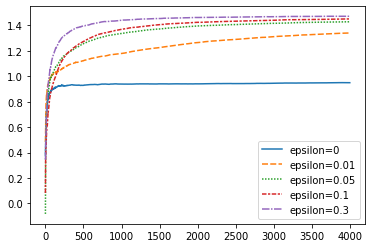

## Reinforcement Learning Notes

####  Basic Notations and Elements

- **Policy**: defines behavior of the learning agent at a given time
- **Reward Function**: defines the goal, or reward mapped to each perceived state
- **Value Function**: define the total reward in long run, our final goal to optimize

** the most important component in almost all RL problems is estimating *values***

Some RF methods don’t necessarily require to search for value functions, for example, the ***evalutionary methods***, including genetic algorithms, genetic programming, simulated annealing and so on.

- **Model**: to generate environment, or mimic the behavior of environments. For example, given a state and action, the model might predict the resultant next state and next reward

#### Evaluative Feedback

**N-armed Bandit Problem**

- **Denotions**
  - *value*: expected or mean reward given a selected action
  - *greedy action*: maintain estimates of each action values for each step, and there is always a greates action win over other actions
  - *Exploiting*: select the greedy action
  - *Exploring*: select the nongreedy action

**Exploitation is the right thing to do to maximize the expected reward on one play, but exploration may produce greater total reward in the long run**

**Action-Value Methods**

- **Denotions**

  - *a*: an action
  - $Q^{*}(a)$: true (actual) value of action *a*
  - $Q_{t}(a)$: estimated value of action *a*
  - *t*: rount of play
  - $k_{a}$: the times of action a has been chosen
  - $r_{k_{a}}$: the reward of action a after it has been chosen k times

  Then a simple way to estimate $Q_{t}(a)$ is:

  $Q_{t}(a)$ = $\frac{r_{1}+r{2}+…+r_{k_{a}}}{k_{a}}$

  If $k_{a}=0$, then default value is $Q_{t}(a)=0$;

  if $k_{a} \rightarrow \infty$, by the large number law, $Q_{t}(a) \rightarrow Q^{*}(a)$

- **$\epsilon$-greedy vs. greedy**

  design an experiment to asses the effectiveness of these two methods

  `Settings`:

  - 2000 n-armed bandit games, 1000 plays for each game
  - n=10, for each game
  - For each action, reward is randomly generated from $N~(Q^{*}(a),1)$ for 1000 round of plays
  - $Q^{*}(a)$ is randomly generated from $N(0,1)$ 2000 times for 2000 different games
  - record the performance after each 1000 plays
  - set $\epsilon$=0, 0.01, and 0.1

The code has been recaptured by myself. Here are the analytical results of $\epsilon$-greedy mrthods.

the above image depicts the total reward accumulated under different $\epsilon$ with 50 games, and 4000 rounds in each game.

This image depicts the optimal action’s accumulated reward. Other parameters setting is the same.